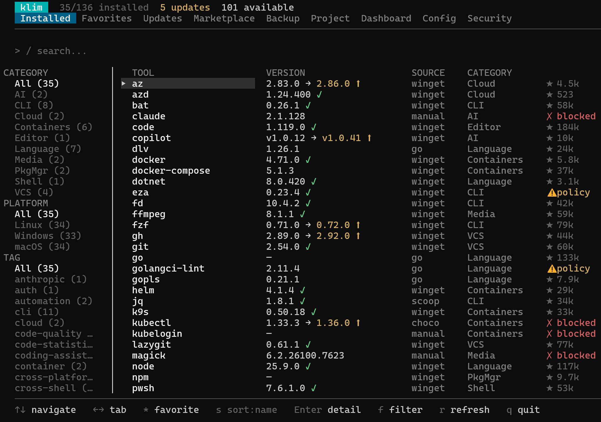
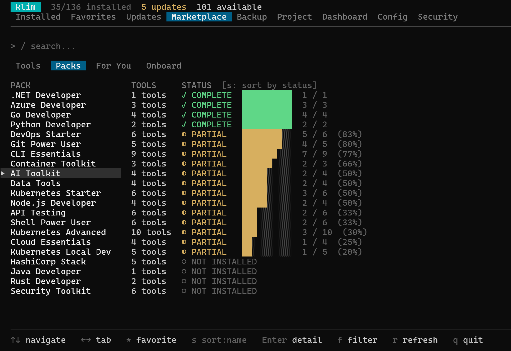
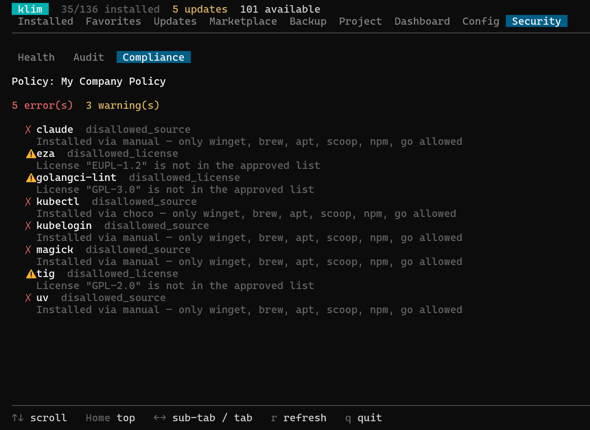
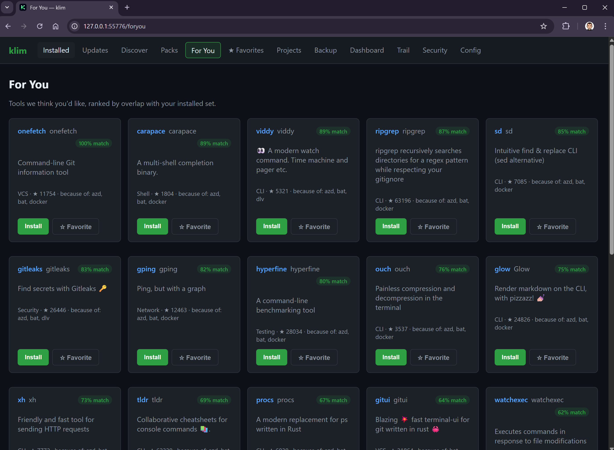

<p align="center">
  
</p>

<h1 align="center">klim</h1>

<p align="center">
  <strong>Reignite Dev Experience.</strong>
</p>

<p align="center">
  <a href="https://github.com/nassiharel/klim/releases/latest"></a>
  <a href="https://github.com/nassiharel/klim/actions/workflows/ci.yml"></a>
  <a href="https://github.com/nassiharel/klim/actions/workflows/codeql.yml"></a>
  <a href="https://goreportcard.com/report/github.com/nassiharel/klim"></a>
  <a href="https://pkg.go.dev/github.com/nassiharel/klim"></a>
  <a href="go.mod"></a>
  <a href="LICENSE"></a>
</p>

<p align="center">
  <a href="https://github.com/nassiharel/klim/commits/main"></a>
  <a href="https://github.com/nassiharel/klim/graphs/contributors"></a>
  <a href="https://github.com/nassiharel/klim/issues"></a>
  <a href="https://github.com/nassiharel/klim/blob/main/CONTRIBUTING.md"></a>
  
</p>

---

Klim is a productivity booster for dev tools: a deterministic, cross-platform layer for discovering, standardizing, securing, and automating the tools every project depends on. It keeps native package managers in charge of installation while giving humans, teams, CI, and AI agents the same portable environment contracts and predictable operations.

<p align="center">
  
</p>

## Quick install

```bash
# macOS / Linux — script
curl -fsSL https://raw.githubusercontent.com/nassiharel/klim/main/install.sh | bash

# Windows PowerShell — script
irm https://raw.githubusercontent.com/nassiharel/klim/main/install.ps1 | iex

# Homebrew (macOS / Linux)
brew install nassiharel/tap/klim

# Scoop (Windows)
scoop bucket add nassiharel https://github.com/nassiharel/scoop-bucket
scoop install klim

# winget (Windows — once the Microsoft moderators merge the auto-submitted PR)
winget install nassiharel.klim

# Go install (any OS with Go 1.25+)
go install github.com/nassiharel/klim/cmd/klim@latest
```

Launch the interactive TUI:

```bash
klim
```

Or use deterministic commands from scripts, CI, or agents:

```bash
klim check --output json
klim diff teammate.yaml
klim security audit --sbom
klim install --pack go-developer
```

---

## What Klim gives you

### Map your environment

Klim scans your `PATH` and native package managers to show installed developer tools, versions, install sources, binary paths, GitHub metadata, project references, pack membership, and update status.

### Standardize project requirements

Drop a `.klim.yaml` in a repo to define required and optional tools with version constraints. `klim check` validates every developer's environment locally or in CI, and `klim init` can generate the contract from project files such as `package.json`, `go.mod`, Dockerfiles, CI workflows, Helm charts, Terraform, Bicep, and more.

### Reproduce and move toolchains

Export, import, share, diff, and capture environment snapshots. Klim maps tools to the best available package manager on each OS, so a known-good setup can move between macOS, Linux, Windows, containers, and teammates.

### Automate through native package managers

Klim delegates installs and upgrades to the package managers you already trust: winget, Homebrew, apt, Chocolatey, Scoop, snap, and npm. It adds selection, planning, JSON output, exit codes, dry runs, packs, and cross-manager visibility without replacing those managers.

### Audit trust and security

Run health checks, security audits, license inventory, vulnerability scans, and CycloneDX SBOM generation across your toolchain. Klim flags PATH problems, unmanaged installs, archived upstreams, stale repositories, missing versions, and known CVEs/GHSAs.

### Give agents deterministic primitives

AI agents are good at translating intent. Klim is the stable local primitive they should call for environment operations. Instead of asking an agent to improvise package-manager commands, let it run `klim check`, `klim install`, `klim diff`, or `klim security audit --output json` and parse predictable results.

---

## Screenshots

<table>
  <tr>
    <td align="center"><strong>Installed</strong><br><sub>Every tool, every version, every install source</sub></td>
    <td align="center"><strong>Dashboard</strong><br><sub>Score, coverage, GitHub highlights, package-manager mix</sub></td>
  </tr>
  <tr>
    <td></td>
    <td></td>
  </tr>
  <tr>
    <td align="center"><strong>Marketplace</strong><br><sub>110+ curated tools with category, stars, and policy state</sub></td>
    <td align="center"><strong>Curated packs</strong><br><sub>Bundle status across Cloud Essentials, Kubernetes Starter, Go Developer, …</sub></td>
  </tr>
  <tr>
    <td></td>
    <td></td>
  </tr>
  <tr>
    <td align="center"><strong>For You</strong><br><sub>Personalised recommendations ranked by overlap with your installed set</sub></td>
    <td align="center"><strong>Project scan</strong><br><sub>Auto-detect required tools from <code>go.mod</code>, <code>package.json</code>, <code>.github/</code></sub></td>
  </tr>
  <tr>
    <td></td>
    <td></td>
  </tr>
  <tr>
    <td align="center"><strong>Compliance</strong><br><sub>Disallowed sources, blocked tools, license violations against your active policy</sub></td>
    <td align="center"><strong>Local browser</strong><br><sub><code>klim browser</code> — same data and actions as the TUI in your default browser</sub></td>
  </tr>
  <tr>
    <td></td>
    <td></td>
  </tr>
</table>

> Nine TUI tabs and an optional local web view. Same data, same actions, same JSON — whichever surface you prefer.

---

## Core workflows

| Workflow | Commands |
| --- | --- |
| Map this machine | `klim`, `klim list`, `klim info kubectl` |
| Standardize a project | `klim init`, `klim check`, `klim generate github-action` |
| Reproduce an environment | `klim export`, `klim import`, `klim env show`, `klim env apply` |
| Compare machines | `klim diff baseline.yaml`, `klim trail capture`, `klim trail diff` |
| Audit and score | `klim security health`, `klim security audit`, `klim score`, `klim security vuln` |
| Automate installs | `klim install jq`, `klim upgrade --pack go-developer`, `klim remove jq`, `klim watch` |
| Agent-safe execution | `klim check --output json`, `klim install --dry-run --output json` |

## Feature map

- **Interactive TUI**: Installed, Favorites, Updates, Marketplace, Backup, Project, Dashboard, Config, and Security views.
- **Marketplace and packs**: Browse 110+ curated developer tools, install bundles, and create custom packs.
- **Team manifests**: Versioned `.klim.yaml` contracts for local checks, CI, generated workflows, Dockerfiles, and devcontainers.
- **Environment tokens**: `klim env` captures tools, favorites, custom packs, package managers, Klim version, OS, and security state into a privacy-safe token.
- **Backup and sharing**: Manifest exports, share tokens, saved backups, cross-machine imports, and OS-aware package-manager mapping.
- **Toolchain history**: `klim trail` captures content-addressed snapshots that can be labeled, diffed, pruned, and compared over time.
- **Environment diff**: Compare local tools against manifests or tokens and see matches, version differences, local-only tools, and remote-only tools.
- **Security and compliance**: Health checks, audits, vulnerability lookup through OSV.dev, license inventory, policy enforcement, and SBOM output.
- **Shell integration**: Native completions and hooks that automatically run `.klim.yaml` checks when you enter a project.
- **Auto-install shims**: `klim proxy` creates lightweight shims that install missing tools on first use through the best available package manager.
- **Onboarding and discovery**: Role-based recommendations, related-tool suggestions, `klim why`, and `klim try` for temporary installs.
- **Custom marketplaces**: Merge extra catalog URLs with the default marketplace for internal or community tool definitions.

---

## Why not just use an agent with shell access?

Agents can translate fuzzy intent into commands, but environment operations need determinism, auditability, local privacy, and stable artifacts. Klim and agents solve different parts of the problem.

### Where agents help

- Turning ambiguous requests into concrete tasks.
- Explaining unfamiliar tools and trade-offs.
- Composing multi-step plans across repositories.

### Where Klim should be the primitive

- **Determinism**: `klim install --pack go-developer --output json` exits the same way every time. A prompt does not.
- **Trust boundary**: Klim uses a curated, versioned catalog and native package managers instead of arbitrary `curl | bash` suggestions from model context.
- **Compliance as code**: `.klim.yaml` and policy files are reviewable contracts. Prompt instructions are not auditable controls.
- **Privacy and offline use**: Tool inventories, project requirements, paths, and policies stay local unless you explicitly export or share them.
- **Stable artifacts**: Manifests, share tokens, env tokens, trail snapshots, and JSON output outlive a chat session.
- **CI safety**: Klim has stable exit codes and schemas without token spend or model drift.

The honest framing: **agents handle judgment calls; Klim handles operations that must be the same every time.**

---

## Architecture

Klim is written in Go with a Bubble Tea TUI and Cobra CLI. The runtime flow is:

```text
ToolService
  -> ToolCatalog     fetch/cache marketplace.yaml from GitHub
  -> ToolFinder      scan PATH and detect install sources
  -> VersionResolver query native package managers for installed/latest versions
```

Version data comes from native package managers, not a private registry:

| Package manager | Platforms | Used for |
| --- | --- | --- |
| winget | Windows | Installed and latest versions |
| Chocolatey | Windows | Installed and latest versions |
| Homebrew | macOS, Linux | Installed and latest versions |
| apt / dpkg | Debian/Ubuntu | Installed and latest versions |
| snap | Linux | Installed and latest versions |
| npm | All | Installed and latest versions |

The marketplace is fetched from `https://raw.githubusercontent.com/nassiharel/klim/marketplace/marketplace.yaml` and cached locally for offline use.

## Configuration

Klim stores user data under the platform config directory:

| OS | Marketplace cache |
| --- | --- |
| macOS | `~/Library/Application Support/klim/marketplace-cache.yaml` |
| Linux | `~/.config/klim/marketplace-cache.yaml` |
| Windows | `%AppData%\klim\marketplace-cache.yaml` |

Use:

```bash
klim config path
klim config edit
```

## Troubleshooting

| Problem | Solution |
| --- | --- |
| `klim: command not found` | Ensure the install directory is in `PATH`. Use `which klim` on macOS/Linux or `where klim` on Windows. |
| Tool not detected | Verify the binary is in `PATH`, then run `klim` and press `r` or use `--refresh` on CLI commands. |
| Permission denied on upgrade | The native package manager may need elevated privileges. Use `sudo` or an Administrator shell where appropriate. |
| Stale version info | Run `klim security health`, use `--refresh`, or clear the scan cache. |
| Self-update fails | Download the latest archive from [Releases](https://github.com/nassiharel/klim/releases/latest) and replace the binary manually. |

## Contributing

Contributions are welcome. See [AGENTS.md](./AGENTS.md) for architecture, conventions, and development commands.

## License

MIT
