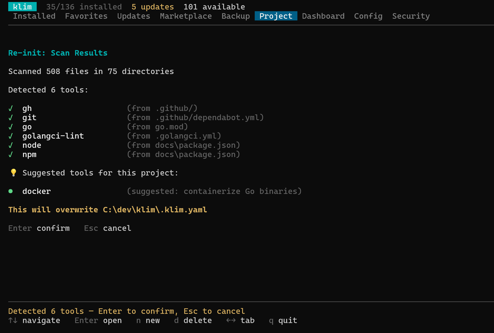

The Klim TUI is an interactive interface for your developer environment. Launch it by running `klim` with no arguments to inspect installed tools, project contracts, updates, health, backups, and configuration from one place.

## Tabs

The TUI has 9 tabs, accessible via arrow keys or number keys:

| Tab | Key | Purpose |
|-----|-----|---------|
| **Installed** | 1 | All detected tools with version status |
| **★ Favorites** | 2 | Your favorited tools |
| **Updates** | 3 | Tools with available upgrades |
| **Marketplace** | 4 | Browse and install (sub-tabs: Tools, Packs, For You, Onboard) |
| **Backup** | 5 | Export, import, share, custom packs, saved backups |
| **Project** | 6 | Multi-project `.klim.yaml` management |
| **Dashboard** | 7 | Stats, gauges, category breakdowns |
| **Config** | 8 | View and edit settings |
| **Security** | 9 | Environment diagnostics, security audit, and compliance (sub-tabs: Health / Audit / Compliance) |

### Marketplace

Browse the full catalog with category, platform, and tag filters; sub-tabs cover individual **Tools**, curated **Packs**, personalised **For You** recommendations, and the role-based **Onboard** wizard.

### Project

Auto-detect required tools from `.github/`, `go.mod`, `package.json`, and friends. Press Enter to write `.klim.yaml`.

### Dashboard

A single page with environment score, tool coverage, attention items, GitHub highlights, top picks, package-manager mix, and category breakdown.

### Security

Health diagnostics, security audit, and policy compliance grouped under one tab.

## Global Keybindings

These work on every tab:

| Key | Action |
|-----|--------|
| `←` / `→` or `Tab` / `Shift+Tab` | Switch tabs (and sub-tabs on Discover/Doctor) |
| `1`–`9` | Jump to specific tab |
| `r` | Refresh — rescan tools |
| `q` or `Ctrl+C` | Quit |

## Tool List Navigation

Used on Installed, Favorites, Updates, and Discover tabs:

| Key | Action |
|-----|--------|
| `↑` / `↓` | Navigate up / down |
| `Enter` | Open detail view |
| `*` | Toggle favorite |
| `s` | Toggle sort (name / stars) |
| `f` | Toggle filter sidebar |

## Filter Sidebar

Press `f` to toggle the filter sidebar. It provides filtering by:

- **Category** — Cloud, CLI, Containers, IaC, Security, etc.
- **Platform** — macOS, Linux, Windows
- **Tags** — automation, kubernetes, monitoring, etc.

Each filter shows a count of matching tools. The sidebar position (left/right) is configurable in `config.yaml` via `ui.sidebar_right`.

## Detail View

Press `Enter` on any tool to see its detail card:

- Display name and description
- Installed version and latest available version
- Install source (brew, winget, apt, etc.)
- Binary path
- Available package manager IDs
- Actions: Install, Upgrade, Remove

Press `Esc` to return to the list.

## Status Indicators

| Icon | Meaning |
|------|---------|
| ✓ | Up to date |
| ⬆ | Update available |
| ★ | Favorited |
| ⏳ | Version check in progress |

## Performance

Version resolution runs concurrently with a configurable semaphore (default: 4 concurrent queries). Package manager timeouts default to 30 seconds and can be adjusted in `config.yaml`.

On subsequent launches, klim uses a scan cache to skip PATH scanning and version resolution, making startup near-instant. Press `r` to force a fresh scan.
